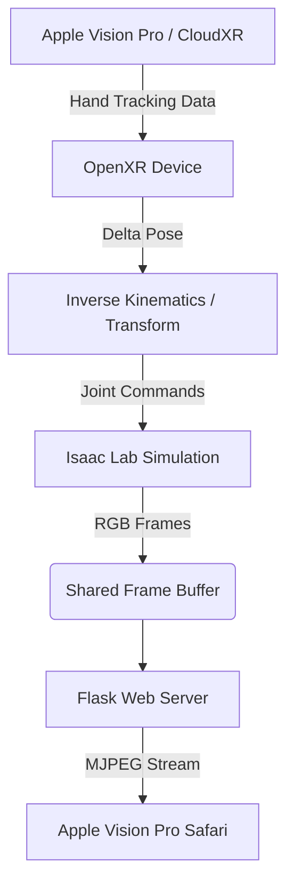
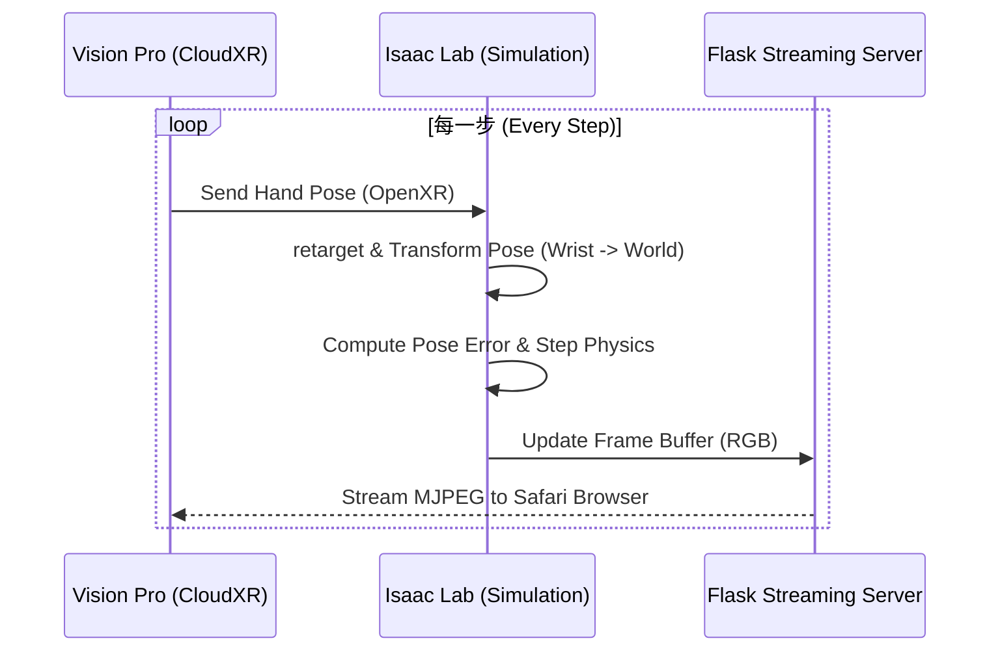

# Kuka Med 7 Development & Technical Documentation

This document provides a comprehensive, chronological record of the development of the Kuka Med 7 robot environment in Isaac Lab. It covers every file, code change, and function implemented.

---

## Phase 1: Foundation (Robot & Assets)

The first step was defining the physical properties and visual model of the Kuka Med 7.

### 1.1 `med7.urdf`
- **Description**: The Unified Robot Description Format file defining the links, joints, and visual/collision meshes of the robot.
- **Key Change**: Modified to ensure mesh paths are correctly resolved within the Isaac Lab project structure.

### 1.2 `source/Kuka_Med_7/Kuka_Med_7/assets.py`
- **Description**: Configures the robot as an Isaac Lab `Articulation`.
- **Functions/Configs**:
    - `MED7_CONFIG`: An `ArticulationCfg` that spawns the robot from the URDF. It configures the PD controller (stiffness/damping) and disables default gravity for the arm to ensure stability during teleoperation.
- **Key Milestone**: Achieving stable joint control without "shaking" by tuning damping to `80.0`.

---

## Phase 2: Environment Logic & Scene Definition

Once the robot was defined, we created the clinical environment and the simulation logic.

### 2.1 `source/Kuka_Med_7/Kuka_Med_7/tasks/med7/med7_env_cfg.py`
- **Description**: Defines the world layout using `DirectRLEnvCfg`.
- **Key Components**:
    - **Hospital Bed & Mount**: Custom cuboids with realistic materials (`BED_COLOR`, `MOUNT_COLOR`).
    - **Lighting**: Realistic cool-white dome lighting (6500K) and warm distant sunlight.
    - **Cameras**: Added `wrist_camera` (on `lbr_link_7`) and `room_camera` (static) for teleoperation feedback.
    - **XR Configuration**: Sets up the `OpenXRDeviceCfg` for VR integration.

### 2.2 `source/Kuka_Med_7/Kuka_Med_7/tasks/med7/med7_env.py`
- **Description**: The core execution logic class `Med7Env` (inherits from `DirectRLEnv`).
- **Function Documentation**:
    | Function | Description |
    | :--- | :--- |
    | `__init__` | Initializes the environment with the provided configuration. |
    | `_setup_scene` | Spawns the robot, props (bed, mount), lights, and cameras. Clones environments for parallel simulation. |
    | `_pre_physics_step` | Internal buffer for joint position targets received from the policy/user. |
    | `_apply_action` | Sends the buffered joint targets to the robot articulation. |
    | `_get_observations` | Returns joint positions and velocities as a tensor. |
    | `_get_rewards` | Placeholder for RL rewards (currently returns zeros). |
    | `_get_dones` | Returns the "done" state based on episode length. |
    | `_reset_idx` | Resets specific environments to their default joint states. |

---

## Phase 3: Basic Simulation & Teleoperation

With the environment ready, we implemented standard scripts for running and manually controlling the robot.

### 3.1 `scripts/run_med7.py`
- **Description**: A basic script to launch the environment and verify that the robot can be stepped.
- **Functions**:
    - `main()`: Sets up the environment and runs a simple loop to render the scene.

### 3.2 `scripts/teleop_med7.py`
- **Description**: Enables Cartesian (End-Effector) control using a keyboard.
- **Functions**:
    - `main()`: Initializes the `Se3Keyboard` device and a `DifferentialIKController` to map keyboard inputs to joint commands.
- **Key Logic**: Uses Inverse Kinematics (IK) to compute the required joint angles to move the end-effector in X, Y, Z space.

---

## Phase 4: VR Integration & Web Streaming (Latest Updates)

The most recent phase focused on **Apple Vision Pro** teleoperation, moving from complex DDS infrastructure to a lightweight web-streaming approach.

### 4.1 `scripts/teleop_med7_vr.py`
- **Description**: The advanced teleoperation script for VR. It starts a Flask server to stream camera views and uses OpenXR for hand tracking.
- **Function Documentation**:
    | Function | Description |
    | :--- | :--- |
    | `generate_mjpeg(camera_key)` | Pulls RGB frames from the shared buffer and yields them as an MJPEG stream. |
    | `wrist_stream()` / `room_stream()` | Flask routes for accessing the camera streams via `/wrist` and `/room`. |
    | `home()` | Provides a web dashboard for the Vision Pro Safari browser. |
    | `run_server()` | Runs the Flask server in a dedicated background thread to prevent simulation lag. |
    | `start_teleop()` / `stop_teleop()` | Callbacks for the VR "START/STOP" hand gestures. |
    | `main()` | Orchestrates the entire system: Flask server, OpenXR polling, Coordinate Transforms, and Simulation stepping. |

### 4.2 Streaming & Control Flowcharts

#### Architecture Overview


#### Detailed Control Loop


---

## Phase 5: Troubleshooting & Debugging

If the VR teleoperation or hand tracking is not working as expected, follow this checklist:

### 1. Launch Requirements
Ensure you are running the script with the CloudXR experience file and environment variables:
```bash
# Set the project and renderer
export EXTERNAL_RENDERER=cloudxr

# Run the VR teleop script
python scripts/teleop_med7_vr.py --num_envs 1 --teleop_device handtracking --experience apps/isaaclab.python.headless.cloudxr.kit
```

### 2. Apple Vision Pro Client
- **IP Address**: Ensure the IP address entered in the Vision Pro app matches your workstation's IP on the **same Wi-Fi network**.
- **Hand Tracking Settings**: Verify that "Hand Tracking" is enabled in the CloudXR Client settings on your Vision Pro.
- **Xcode Checklist**:
    - Ensure your Xcode project has the **Hand Tracking** capability enabled in "Signing & Capabilities".
    - Check that `NSHandsTrackingUsageDescription` is present in your `Info.plist`.
    - Verify that the app is using the **OpenXR Hand Tracking Extension** (check the sample app code if you modified it).
- **START Gesture**: You must perform a **PINCH** gesture (Index finger + Thumb) to activate the robot. Watch the terminal for `[INFO]: Teleop Started`.

### 3. Visual Feedback (Hand Proxy)
I have added a **Hand Visualization Proxy** (a green semi-transparent sphere) to the scene. 
- If you see the green sphere moving but the robot arm is stationary, the hand tracking is working, but the robot might be "Stopped." Check if you have performed the start gesture.
- If you don't see the green sphere at all, the OpenXR device is likely not receiving data from CloudXR.

---

## Summary of Code Evolution

1.  **Direct Joint Control**: Started with simple joint-space movements.
2.  **Differential IK**: Added Cartesian control for intuitive keyboard interaction.
3.  **DDS Integration (Removed)**: Initially attempted RTI DDS for streaming, but replaced it due to complexity.
4.  **Flask + OpenXR**: The final, high-performance solution for Apple Vision Pro teleoperation, combining standard web technologies for streaming with robust hand-tracking retargeting.

